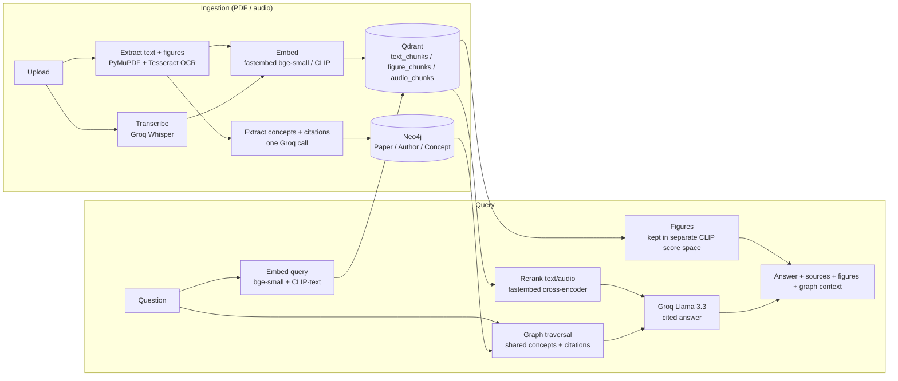

# ResearchOS — Multi-Modal Graph RAG

A Graph RAG system for research papers and audio lectures: ingest PDFs (text + figures) and audio, store vectors in Qdrant and a knowledge graph in Neo4j, and answer cited questions with Groq Llama 3.3.

**Runs on 100% free tier — the only paid-adjacent dependency is a single Groq API key.** No GPU, no torch, no per-token embedding bills.

## Stack

| Layer | Technology |
|---|---|
| LLM generation + concept extraction | Groq `llama-3.3-70b-versatile` |
| Audio transcription | Groq Whisper API (`whisper-large-v3-turbo`) |
| Text embeddings | [fastembed](https://github.com/qdrant/fastembed) (ONNX, in-process, CPU) — `BAAI/bge-small-en-v1.5` |
| Image + CLIP-text embeddings | fastembed — `Qdrant/clip-ViT-B-32-vision` / `-text` |
| Reranking | fastembed `TextCrossEncoder` — `Xenova/ms-marco-MiniLM-L-6-v2` |
| Vector database | [Qdrant](https://qdrant.tech/) |
| Knowledge graph | [Neo4j](https://neo4j.com/) |
| Backend | FastAPI (Python 3.11) |
| Frontend | React 19 + Vite + Tailwind v4 |

No Cohere, no Ollama, no torch/torchvision, no faster-whisper anywhere in the dependency tree — everything CPU-only, everything free tier.

## Architecture



Ingestion runs as a FastAPI `BackgroundTask`: the upload endpoint returns `202` immediately with an id, and the client polls `GET /ingest/status/{id}` until it's `done` or `error`.

## Quickstart

Requires Docker and Docker Compose. CPU-only — no GPU config anywhere in `docker-compose.yml`.

```bash
cp .env.example .env
# edit .env: set GROQ_API_KEY (https://console.groq.com) and NEO4J_PASSWORD

docker compose up -d --build
```

- Frontend: http://localhost:3000
- Backend: http://localhost:8054 (health check: `GET /health`)

Only `GROQ_API_KEY` and `NEO4J_PASSWORD` are required in `.env` — everything else has a working default. See [.env.example](.env.example) for the full list (Qdrant/Neo4j overrides, model names, retrieval tuning).

## API reference

All endpoints are served from the backend root and proxied by the frontend's nginx config under `/api/`.

| Method | Path | Description |
|---|---|---|
| `GET` | `/health` | Reports Qdrant, Neo4j, and Groq-key-configured status individually |
| `POST` | `/ingest/pdf` | Multipart upload (`file`, `title?`, `authors?`, `year?`) → `202 {id, status: "processing"}` |
| `POST` | `/ingest/audio` | Multipart upload (`file`, `title?`, `source_paper_id?`) → `202 {id, status: "processing"}` |
| `GET` | `/ingest/status/{id}` | Poll ingestion status: `processing` \| `done` (with counts) \| `error` (with detail) \| `404` |
| `POST` | `/query` | `{text, top_k?, rerank_top_n?}` → `{answer, sources[], figures[], graph_context}` |
| `GET` | `/graph/nodes` | `?node_type=Paper\|Author\|Concept&limit=` (whitelisted, parameterized) |
| `GET` | `/graph/edges` | `?edge_type=WROTE\|CITES\|HAS_CONCEPT&limit=` (whitelisted, parameterized) |
| `GET` | `/figures/{figure_id}` | Serves the figure image; falls back to a base64 copy stored in Qdrant if the on-disk file is gone (relevant on ephemeral free-tier storage) |

Uploads are capped at 50MB, validated by content (PDF magic bytes / audio extension whitelist), and never trust the client-supplied filename for storage paths.

## Evaluation

`backend/eval/run_eval.py` ingests a small synthetic paper with known facts and runs 14 hand-written Q/A pairs against the live API, checking retrieval hit-rate (did the right passage come back) and citation presence (did the answer cite it):

```bash
docker compose exec backend python eval/run_eval.py
```

Latest run:

| Metric | Result |
|---|---|
| Retrieval hit-rate | 14/14 (100%) |
| Citation presence rate | 14/14 (100%) |

This is a smoke-scale check (one paper, 14 questions) meant to catch retrieval/citation regressions, not a large-scale benchmark.

## Graph RAG

Ingestion makes one Groq call (JSON mode) over each paper's first three pages to extract concepts and cited titles. Concepts become `(:Concept)` nodes linked via `HAS_CONCEPT`; cited titles are fuzzy-matched (case-insensitive substring) against existing paper titles to create `CITES` edges. At query time, `graph_context` is populated by real traversal — direct citations plus other papers sharing a concept with the retrieved results — not a static/empty stub.

## Project structure

```
backend/
  main.py              FastAPI app, lifespan (Qdrant collections + Neo4j constraints), /health, /figures
  config.py             pydantic-settings, reads .env
  routers/               ingest.py, query.py, graph.py
  services/               qdrant_client.py, neo4j_client.py, embedder.py, clip_embedder.py,
                          reranker.py, audio_transcriber.py, concept_extractor.py,
                          pdf_extractor.py, retriever.py, generator.py
  tests/                 pytest suite (mocked Groq/Qdrant/Neo4j, no live services needed)
  eval/                   run_eval.py
frontend/
  src/lib/api.ts          single axios instance, VITE_API_URL ?? '/api'
  src/components/         QueryBar, AnswerCard, SourceChip, FigureCitation, UploadPanel, GraphExplorer
  nginx.conf               proxies /api/ to the backend in the production container
```

## Development

```bash
# Backend tests + lint
cd backend && pip install -r requirements-dev.txt
pytest -v
ruff check .

# Frontend lint + build
cd frontend && npm run lint && npm run build
```

CI (`.github/workflows/ci.yml`) runs both on every push/PR.

## License

MIT — see [LICENSE](LICENSE).
